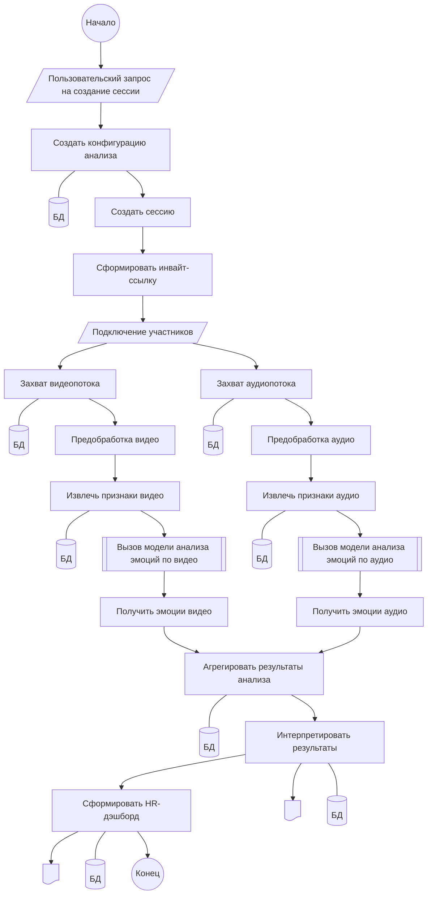

# Сайт 
https://www.mermaidonline.live/ru/editor

```mermaid
flowchart TD

    %% ===== Начало =====
    START((Начало))

    %% ===== A-1 Проведение сессии =====
    START --> IO1[/Пользовательский запрос на создание сессии/]
    IO1 --> ACT1[Создать конфигурацию анализа]

    DB1[(БД)]
    ACT1 --- DB1

    ACT1 --> ACT2[Создать сессию]
    ACT2 --> ACT3[Сформировать инвайт-ссылку]
    ACT3 --> IO2[/Подключение участников/]

    IO2 --> ACT4[Захват видеопотока]
    IO2 --> ACT5[Захват аудиопотока]

    DB2[(БД)]
    DB21[(БД)]
    ACT4 --- DB2
    ACT5 --- DB21

    %% ===== A-2 Обработка данных =====
    ACT4 --> ACT6[Предобработка видео]
    ACT5 --> ACT7[Предобработка аудио]

    ACT6 --> ACT8[Извлечь признаки видео]
    ACT7 --> ACT9[Извлечь признаки аудио]

    DB3[(БД)]
    DB31[(БД)]
    ACT8 --- DB3
    ACT9 --- DB31

    %% ===== A-3 Анализ данных (ИИ) =====
    ACT8 --> NN1[[Вызов модели анализа эмоций по видео]]
    ACT9 --> NN2[[Вызов модели анализа эмоций по аудио]]

    NN1 --> ACT10[Получить эмоции видео]
    NN2 --> ACT11[Получить эмоции аудио]

    ACT10 --> ACT12[Агрегировать результаты анализа]
    ACT11 --> ACT12

    DB4[(БД)]
    ACT12 --- DB4

    %% ===== A-4 Интерпретация и отчет =====
    ACT12 --> ACT13[Интерпретировать результаты]
    ACT13 --> ACT14[Сформировать HR-дэшборд]

    %% ===== Новые связи к пустым документам =====
    ACT13 --> HRDOC
    HRDOC@{ shape: doc, label: " " }

    ACT14 --> REPORTDOC
    REPORTDOC@{ shape: doc, label: " " }

    DB5[(БД)]
    DB6[(БД)]
    ACT13 --- DB6
    ACT14 --- DB5

    %% ===== Конец =====
    ACT14 --> END((Конец))
```